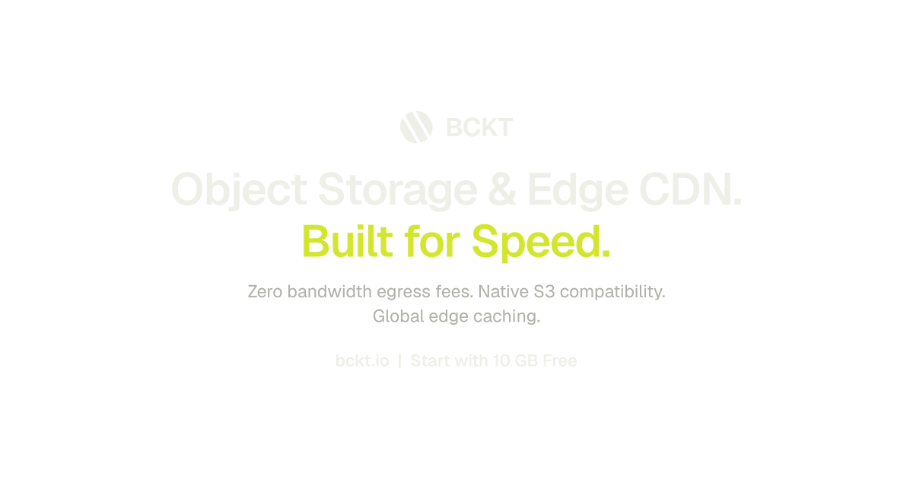

<p align="center">
  <a href="https://bckt.io">
    
  </a>
</p>

# BCKT for FiveM & RedM

Store the photo. Keep the evidence. Find the log.

The official Lua SDK for BCKT. Upload files, capture screenshots and send structured logs from your resources.

No framework required. Your API key stays on the server.

Version 0.1.3 is a beta release. The Lua logic, server binary transport and browser upload bridge have local automated checks. Live FiveM, RedM and capture-provider acceptance tests are still required before calling this production-tested.

## Five lines instead of another HTTP wrapper

```lua
exports['bckt']:Log('economy', {
    event_type = 'vehicle.purchase',
    entity_id = tostring(characterId),
    message = 'Bought a Sultan for $45,000',
    payload = { model = 'sultan', price = 45000 }
})
```

Search it later in your BCKT dashboard by character, event type or message.

## Install

Download the resource from [Releases](../../releases), extract it into your resources directory and name the folder `bckt`. If you clone this repository, rename the resource folder to `bckt` too.

Add this before the resources that use it:

```cfg
set bckt_api_key "bckt_your_api_key"
ensure bckt
```

Use `set`, not `setr` or `sets`. This key belongs on your server, never in a client script or shared configuration. Restart `bckt` after rotating it.

Create your API key at [bckt.io](https://bckt.io). Give it only the permissions your resources need. Create your log streams in the dashboard or with `CreateLogStreamAwait` before sending events to them. The default stream name is `server`.

Set folder defaults, resource permissions and queue limits in [config.lua](config.lua). There is no npm install or build step on your game server.

## A phone photo should go straight to storage

Your server authorizes the upload. The player's client sends the image directly to BCKT using a temporary upload URL.

The API key never leaves the server, and your game server does not have to relay the image.

```lua
local result = exports['bckt']:CreateUploadUrlAwait({
    filename = 'photo.webp',
    content_type = 'image/webp',
    size = imageSize,
    folder = 'phone/photos',
    private = false
})
```

Validate the player and the upload request before issuing that URL. A temporary URL is still permission to upload.

See [the phone upload example](examples/phone-upload). The client helper `UploadImageAwait(ticket, dataUri)` sends the image using the SDK's invisible NUI. A phone with its own browser UI can send a Blob directly instead.

## Screenshots, without writing the plumbing

With either [`screenshot-basic`](https://github.com/citizenfx/screenshot-basic) or [`screencapture`](https://github.com/itschip/screencapture) installed and started before `bckt`:

```lua
local result = exports['bckt']:CaptureScreenshotAwait(playerId, {
    folder = 'reports',
    private = true,
    encoding = 'webp',
    quality = 0.85
})

if result.success then
    print(result.data.file.id, result.data.url)
end
```

The SDK handles capture, authorization, direct upload and a server-side catalog check. Captures require both `files:write` and `files:read`. They default to private. Both capture resources are optional; everything else works without them.

The adapter uses each resource's `requestScreenshot` export and uploads raw bytes through BCKT. `BcktConfig.captureProvider` defaults to `auto`: it uses screenshot-basic when started, otherwise screencapture. Set it to `screencapture` to prefer that resource, or pass `provider = 'screencapture'` per capture. A failed capture is not retried through another provider. This integration supports still images, not video or live streaming. RedM capture support depends on the chosen resource and must be tested in-game. A screenshot supplied by a player's client is not proof that the client is trustworthy.

## Public when you want it. Private when you need it.

Use public files for images your players need to share. Use private files for material that should require a temporary access link.

```lua
local result = exports['bckt']:GetFileUrlAwait(fileId)

if result.success then
    print(result.data.url)
else
    print(result.error.code, result.error.message)
end
```

Private access links currently last one hour. Upload tickets last 15 minutes. Use the returned expiration rather than calculating it yourself. Anyone holding a signed URL can use it until it expires.

## Logs that keep their context

A message tells you what happened. Structured fields help you find it.

Keep character IDs in `entity_id`, use consistent event names, and put the details in `payload`. Avoid collecting IP addresses, tokens or private conversations unless your application actually needs them.

`Log` queues an event. It does not mean the event has reached BCKT.

Use `SendLogsAwait` when your code needs to wait for API acceptance. Neither method replaces your database transactions or independent backups.

## When a request fails

Every HTTP operation returns `success` and either `data` or `error`.

Handle the result. A full storage quota, a revoked key and a temporary connection failure need different responses.

Read requests have bounded retries. Queued logs retry explicit rate-limit responses with a delay. An ambiguous write becomes `uncertain`, not an automatic duplicate. Rejected logs remain in the bounded queue until you retry or explicitly discard them.

Optional log persistence stores events locally in resource KVP storage. It is off by default, is not encrypted, and is not a guaranteed durable message broker. Without it, stopping the resource loses pending events. See [failure handling](docs/operations.md).

## Pick what you need

| Task | Exports |
| --- | --- |
| Upload content | `UploadFile`, `UploadResourceFile`, `UploadJson` |
| Authorize a direct upload | `CreateUploadUrl` |
| Browse storage | `ListFiles`, `ListFolders` |
| Manage files | `GetFileUrl`, `SetFileVisibility`, `DeleteFile`, `DeleteFiles` |
| Remove a folder and its contents | `DeleteFolder` |
| Sign an S3 operation | `CreateS3Url` |
| Write logs | `Log`, `LogBatch`, `SendLogs`, `Debug`, `Info`, `Warn`, `Error` |
| Work with streams | `ListLogStreams`, `CreateLogStream`, `QueryLogs` |
| Manage the queue | `FlushLogs`, `RetryLogs`, `DiscardLogs` |
| Capture a player screenshot | `CaptureScreenshot` |
| Upload a client image | `UploadImage` |
| Inspect the SDK | `IsReady`, `GetStatus`, `GetQueueStats`, `GetVersion` |

HTTP operations also have an `Await` variant. Call these from a yieldable Lua thread. The [export reference](docs/exports.md) covers arguments, permissions and return values. Callback variants are provided for integrations that cannot await.

## Something broken?

Open an issue with your SDK version, server artifact version and a small example that reproduces it. Include the BCKT request ID if one was returned.

Remove API keys, signed URLs and player data before posting.

Account or billing question? [hello@bckt.io](mailto:hello@bckt.io).
